# Chatbot UI Sequence Diagram

This diagram visualizes the interaction flow within the `chatbot.html` frontend, including WebSocket streaming for the chat interface and HTTP API calls for plan execution.

```mermaid
%%{init: {'theme': 'dark', 'themeVariables': {'actorTextColor': '#ffffff', 'signalTextColor': '#ffffff', 'noteTextColor': '#ffffff', 'lineColor': '#888888'}}}%%
sequenceDiagram
    participant User
    participant Browser as Client (chatbot.html)
    participant WS as WebSocket API<br/>(/ws/stream)
    participant API as HTTP API<br/>(FastAPI)
    participant DB as Database<br/>(MySQL)
    participant Router as Router LLM<br/>(Table Selection)
    participant Generator as Generator LLM<br/>(Instruction)

    Note over Browser, DB: Initialization (Page Load)
    Browser->>API: POST /conversations
    Note right of API: Create new conversation session
    API->>DB: INSERT new conversation
    DB-->>API: Return conversation_id
    API-->>Browser: {"id": "conv_xxx"}
    
    Browser->>API: GET /conversations/{id}/messages
    API->>DB: SELECT messages + artifacts
    DB-->>API: Message history
    API-->>Browser: JSON Message List
    Browser->>Browser: Render History Bubbles
    
    Browser->>WS: Connect WebSocket<br/>(/ws/stream?conversation_id=conv_xxx)
    WS-->>Browser: Connection Open

    rect rgb(30, 60, 90)
        Note over User, Generator: Multi-Turn Conversation Loop
        
        loop Each User Message
            Note over User, Browser: User Interaction (Turn N)
            User->>Browser: Enters Message & Sends
            Browser->>Browser: Render User Bubble
            Browser->>WS: Send {"content": "...", "source": "user"}
            
            rect rgb(20, 50, 80)
                Note right of WS: Backend Processing Phase
                
                WS->>DB: INSERT user message
                DB-->>WS: message_id
                
                WS->>Router: Send User Query + User History + Available Tables
                Note right of Router: Router analyzes full conversation<br/>context and selects relevant tables
                Router-->>WS: Return Selected Table IDs (JSON)
                WS->>WS: Cache Selected Tables
                WS->>WS: Format Table Cards
                WS-->>Browser: {"type": "relevant_tables",<br/>"content": [{id, name, desc}, ...]}
                Note right of Browser: Display table cards immediately
                
                WS->>Generator: Send Query + History (last 10 turns) + Selected Tables
                Note right of Generator: Generates response with<br/>conversation context awareness
                
                loop Token Stream
                    Generator-->>WS: Token Chunk
                    WS-->>Browser: {"type": "token", "content": "..."}
                    Browser->>Browser: Smooth character-by-character reveal
                end
                
                Generator-->>WS: Generation Complete
                WS->>DB: INSERT assistant message
                DB-->>WS: assistant_message_id
                
                WS->>DB: INSERT artifact (relevant_tables)
                DB-->>WS: OK
                
                WS-->>Browser: {"type": "done", "message_id": "msg_xxx"}
            end
            
            Browser->>Browser: Process Final Bubble
            Note right of Browser: Parses "思考过程" and<br/>"Refined Instruction"
            
            Browser->>Browser: Add Rollback Button (using message_id)
            
            alt Has Instruction
                Browser->>Browser: Show "确认方案并执行" Button
            end
        end
    end

    opt User Triggers Rollback
        User->>Browser: Clicks Rollback Button
        Browser->>API: POST /messages/{message_id}/rollback
        API->>DB: DELETE messages after specified message
        DB-->>API: Success
        API-->>Browser: {"status": "ok"}
        Browser->>Browser: Clear UI
        Browser->>API: GET /conversations/{id}/messages
        API->>DB: SELECT updated history
        DB-->>API: Truncated message list
        API-->>Browser: JSON Message List
        Browser->>Browser: Re-render History
    end

    opt User Confirms Plan (Optional)
        User->>Browser: Clicks "确认方案并执行"

        rect rgb(20, 80, 40)
            Note right of Browser: Plan Execution Phase
            Browser->>API: GET /latest-request
            API-->>Browser: Return Template JSON

            Browser->>Browser: Update template.userInstruction = Plan

            Browser->>API: POST /api/etl-json/generate
            Note right of Browser: Sends updated template payload

            alt Success
                API-->>Browser: Return ETL Result JSON
                Browser->>API: POST /messages/{id}/artifacts<br/>{"type": "etl_plan", "content": {...}}
                API->>DB: INSERT artifact (etl_plan)
                Browser->>Browser: Show Result in System Bubble
            else Failure
                API-->>Browser: Error Response
                Browser->>Browser: Show Error in Bubble
            end
        end
    end
```



## Interaction Steps

### Multi-Turn Conversation Flow

The chatbot supports **continuous multi-turn conversations** with database persistence and intelligent context management:

1.  **Initialization (Page Load)**: 
    - **POST** `/conversations` - Creates a new conversation session in the database
    - Receives unique `conversation_id` from server
    - **GET** `/conversations/{conversation_id}/messages` - Fetches conversation history (including messages and artifacts)
    - Renders previous conversation history if any exists
    - Establishes persistent WebSocket connection to `/ws/stream?conversation_id={conversation_id}`

2.  **Conversation Loop** (Repeats for each user message):

    **Turn N - User Input**:
    - User sends a message via the chat interface
    - Frontend renders user bubble and sends to WebSocket: `{"content": "...", "source": "user"}`
    - Backend **persists user message to database** immediately (returns `message_id`)

    **Turn N - Table Selection** (Always Runs):
    - **Router LLM** analyzes:
      - Current user query
      - Full user conversation history (all previous user messages)
      - All available tables with field schemas and sample values
      - Previous table selection (as hint)
    - Router uses **domain knowledge** to select semantically relevant tables
    - Returns table IDs as JSON: `{"relevant_table_ids": ["id1", "id2"]}`
    - Backend caches selected tables for this session
    - Sends table cards to frontend: `{"type": "relevant_tables", "content": [{id, name, desc}, ...]}`
    - Frontend **displays table cards immediately** (before assistant response starts)

    **Turn N - Response Generation**:
    - Backend formats context with selected tables (field names, labels, sample values)
    - Sends to Generator LLM:
      - Current query
      - **Conversation history (last 10 turns)** from database
      - Selected tables context (compressed schema)
    - Generator produces response with conversation awareness
    - Streams tokens in real-time: `{"type": "token", "content": "..."}`
    - Frontend performs **smooth character-by-character reveal** (accelerating animation)
    - Backend **persists assistant message to database** after completion
    - Backend **persists artifacts** (relevant_tables) linked to message
    - Sends completion: `{"type": "done", "message_id": "msg_xxx"}`

    **Turn N - Response Processing**:
    - Frontend parses assistant response:
      - **思考过程 (Thinking Process)**: Collapsible SQL/analysis section
      - **Refined Instruction**: Executable plan/instruction
    - Adds **rollback button** to assistant bubble header (using `message_id`)
    - Shows "确认方案并执行" button if instruction exists

3.  **Rollback Functionality** (Available anytime):
    - User clicks rollback button on any assistant message
    - **POST** `/messages/{message_id}/rollback` - Deletes all messages created after this message
    - Frontend reloads conversation history
    - Session cache is reset
    - **Note**: Rollback confirms with user before executing (data loss warning)

4.  **Plan Execution** (Optional, can happen at any turn):
    - User clicks "确认方案并执行" button on any instruction
    - Frontend fetches **GET** `/latest-request` template (debugging/template data)
    - Injects the plan into `template.userInstruction`
    - **POST** to `/api/etl-json/generate` with updated template
    - On success:
      - **POST** `/messages/{message_id}/artifacts` - Saves ETL plan as artifact
      - Displays result in system bubble with collapsible JSON
      - Attempts remote sync to production environment
    - On failure: Shows error in bubble
    - **Conversation continues** - user can ask follow-up questions or refine the plan

### Key Multi-Turn Features

**Database Persistence**:
- **Conversations**: Each page load creates a new conversation with unique ID
- **Messages**: All user and assistant messages stored with `conversation_id`, `role`, `content`, `created_at`
- **Artifacts**: Structured data (table selections, ETL plans) linked to specific messages
- **Rollback**: Hard delete of messages and cascading delete of linked artifacts
- **History API**: Fetch full conversation thread with all artifacts on demand

**Table Selection Strategy**:
- **Always Run Router**: Router runs on EVERY user message (no caching across turns)
- **Context-Aware**: Router sees full user conversation history for intent evolution
- **Domain Knowledge**: Built-in CDISC/SDTM expertise for semantic table matching
- **Comprehensive Coverage**: Analyzes all steps in multi-step requests (Step 1 → Table A, Step 4 → Table B)
- **Sample Values**: Tables formatted with field labels and sample values for better matching

**Conversation Patterns Supported**:
- **Clarification**: "Can you explain step 3 in more detail?"
- **Refinement**: "Actually, I also need to check the AE table" → Router re-runs and selects additional tables
- **Follow-up**: "What if I want to exclude screening visits?"
- **Rollback & Retry**: User can rollback to any previous state and try a different approach
- **Plan Iteration**: User can execute plan, see results, then refine and re-execute

## Table Cards Feature

**Purpose**: Visual feedback showing which tables were selected by the Router for the current query.

**Flow**:
- Sent via WebSocket **immediately after Router selection**: `{"type": "relevant_tables", "content": [{id, name, desc}, ...]}`
- Displayed **before** assistant response begins streaming
- Rendered as compact cards in the streaming bubble
- **Persisted as artifact** linked to the assistant message in database

**Card Structure**:
```
┌─────────────────────┐
│ 人口学资料 (DM)      │ ← Table Name (Chinese + English)
│ No description      │ ← Table Description
└─────────────────────┘
```

**Selection Behavior**:
- **Every Query**: Router runs on EVERY user message (no cross-turn caching)
- **Context-Aware**: Router analyzes full conversation history to understand intent evolution
- **Domain-Driven**: Uses CDISC/SDTM expertise to select semantically relevant tables
- **Comprehensive**: Analyzes ALL steps in multi-step requests (e.g., Step 1 needs DM, Step 4 needs AE → selects both)

**Benefits**:
- **Transparency**: User sees which tables are being used for context
- **Debugging**: Helps identify if Router selected wrong/missing tables
- **Conversation Continuity**: Router adapts selection as conversation evolves
- **Audit Trail**: Table selections stored as artifacts in database

**Database Persistence**:
- Each assistant message has linked `relevant_tables` artifact
- Artifact contains full table metadata (id, name, description)
- Rollback deletes artifacts along with messages (cascading delete)
- History API returns messages with all linked artifacts

## Recent Improvements

### 1. Database Persistence Migration (2026-01-27)
**Problem**: Conversation history stored in JSON file, no support for rollback, difficult to manage artifacts.

**Solution**: Migrated to MySQL database with full ACID guarantees:
- **Tables**:
  - `chatbot_conversations`: Stores conversation metadata (id, title, created_at)
  - `chatbot_messages`: Stores all messages (id, conversation_id, role, content, created_at)
  - `chatbot_message_artifacts`: Stores structured data linked to messages (id, message_id, type, content, created_at)
- **Character Set**: `utf8mb4` with `utf8mb4_unicode_ci` collation for full Chinese character support
- **Features**:
  - **Rollback**: Delete messages after a specific point (cascading delete of artifacts)
  - **Artifact Tracking**: Link ETL plans and table selections to specific messages
  - **Conversation History**: Fetch complete conversation thread with artifacts
  - **Session Management**: Each page load creates new conversation (fresh context)

**API Changes**:
- **Removed**: `GET /history?clear=true`, `POST /conversation`
- **Added**:
  - `POST /conversations` - Create new conversation
  - `GET /conversations/{id}/messages` - Fetch history with artifacts
  - `POST /messages/{id}/rollback` - Rollback to specific message
  - `POST /messages/{id}/artifacts` - Save artifact (e.g., ETL plan)

### 2. Enhanced Formatting Rules (2026-01-12)
**Problem**: LLM inconsistently formatted table names, sometimes outputting `访视(VISIT)表` instead of `[[访视(VISIT)]]`.

**Solution**:
- **Backend (System Prompt)**: Strengthened formatting rules with explicit examples:
  - ✅ CORRECT: `[[访视(VISIT)]]`, `[[不良事件(AE)]]`
  - ❌ WRONG: `访视(VISIT)表`, `AE表`, `访视(VISIT)`
  - Rule applies to ALL mentions: main instruction, warnings, notes
- **Frontend (Fallback)**: Added regex auto-correction in `formatMarkdown()`:
  ```javascript
  // Auto-wrap: 访视(VISIT)表 → [[访视(VISIT)]]
  text = text.replace(/([\u4e00-\u9fa5]+)\(([A-Z0-9_]+)\)表/g, '[[$1($2)]]');
  ```

### 3. Intelligent Router Selection (2026-01-12)
**Problem**: Router only selected explicitly mentioned tables, missing related tables needed for comprehensive analysis.

**Example**: User asks to verify EC2 table → Router only selects EC2 → Generator mentions "need AE and VISIT tables but cannot access them" → Incomplete analysis.

**Solution**: Enhanced Router with domain knowledge:
- **Context Analysis**: Router analyzes full conversation history (all previous user messages)
- **Domain Expertise**: Built-in CDISC/SDTM knowledge for semantic table matching
- **Comprehensive Coverage**: Analyzes ALL steps in multi-step requests
- **Table Relationships**:
  - Medication tables (EC, EX, CM) → auto-includes AE (Adverse Events)
  - Clinical event tables → auto-includes VISIT (Visit Schedule)

**Impact**: 
- Before: 1 table selected → incomplete analysis with warnings
- After: 3 tables selected (EC2 + AE + VISIT) → complete executable plan
- Router now runs on EVERY message (no caching) for maximum context awareness

