# ETL Chat Strategy Sequence Diagram

This diagram visualizes the control flow within the `chat` ETL strategy, specifically how `ETLAgent`, `ChatSchemaGenerator`, `ChatSchemaPlanner`, and `ChatSchemaBuilder` interact.

```mermaid
%%{init: {'theme': 'dark', 'themeVariables': {'actorTextColor': '#ffffff', 'signalTextColor': '#ffffff', 'noteTextColor': '#ffffff', 'lineColor': '#888888'}}}%%
sequenceDiagram
    participant User
    participant ETLAgent as ETLAgent<br/>(orchestrator.py)
    participant Workflow as LangGraph Workflow<br/>(workflow_engine.py)
    participant Generator as ChatSchemaGenerator<br/>(generator.py)
    participant Planner as ChatSchemaPlanner<br/>(planner.py)
    participant Builder as ChatSchemaBuilder<br/>(builder.py)
    participant Toolkit as Toolkit<br/>(toolkit.py)
    participant LLM as LLM (DeepSeek)

    User->>ETLAgent: process_request()
    ETLAgent->>Workflow: invoke(initial_state)
    Workflow->>Generator: generate(state)
    Note over Generator: Extract user_instruction<br/>from metadata
    
    Generator->>Planner: plan(transformed_data, actions, instruction)
    Planner->>Builder: Initialize builder & initial DAG
    Planner->>Planner: Build System Prompt

    loop Multi-turn Planning (Max 30 iterations)
        rect rgb(20, 50, 80)
            Note right of Planner: DAG State & Prompting
            Planner->>Planner: Generate DAG Description (Nodes & Fields)
            Note right of Planner: Optimization: Only current DAG state (Nodes + Aliases) is injected.<br/>Full schema JSON is excluded to save tokens.
            Planner->>Planner: Update System Prompt = Static Instruction + DAG Desc
            Planner->>LLM: ainvoke(messages + DAG state)
        end
        LLM-->>Planner: Tool Calls (Select/Transform/Join) or Final Text
        
        alt Tool Calls Present
            loop For each tool call
                Planner->>Builder: execute_step(schema, tool, args)
                Builder->>Toolkit: Invoke specific tool<br/>(e.g., add_select_columns_node)
                
                rect rgb(20, 80, 40)
                    Toolkit->>Toolkit: Update Schema JSON (In-Place)
                end
                
                Toolkit-->>Builder: New Node ID
                
                rect rgb(20, 50, 80)
                    Builder->>Builder: Update DAG state based on the updated Schema (Shared Instance)
                end
                
                Builder-->>Planner: New Node ID
                Planner->>Planner: Log execution & Append history
            end
        else No Tool Calls
            rect rgb(20, 50, 80)
                Planner->>Planner: Check Stopping Conditions (DAG Convergence)
            end
            alt Converged
                rect rgb(20, 80, 40)
                    Planner->>Generator: Return modified schema
                end
            else Not Converged
                Planner->>LLM: Reject with Watchdog Error
            end
        end
    end

    Generator-->>Workflow: Result Schema
    Workflow-->>ETLAgent: Final Result
    ETLAgent-->>User: Response (Final JSON)
```

## Component Roles

- **ETLAgent**: Entry point, initializes the workflow state.
- **Workflow**: Manages the high-level ETL lifecycle.
- **ChatSchemaGenerator**: Strategy-specific entry point for the "chat" mode.
- **ChatSchemaPlanner**: The brain. It invokes the LLM, maintains the conversation loop, and decides which actions to take.
- **ChatSchemaBuilder**: The executor. It translates abstract tool calls into concrete state changes (DAG updates) and manages the `node_xxx` IDs.
- **Toolkit**: Low-level functions that manipulate the internal schema structures.
